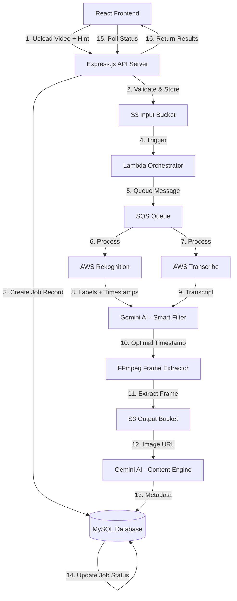

# Design Document: Video-to-Listing Pipeline

## Overview

The Video-to-Listing Pipeline is a cloud-native, event-driven system that transforms influencer promotional videos into marketplace-ready product listings. The architecture leverages AWS managed services (S3, Lambda, SQS, Rekognition, Transcribe) and Gemini AI to create a scalable, asynchronous processing pipeline.

The system accepts a video upload with a user-provided product hint, processes it through multiple AI services to identify the optimal product frame, extracts that frame, generates SEO-optimized metadata, and stores the results in a MySQL database. The frontend polls for job status until processing completes.

**Key Design Principles:**
- Asynchronous, event-driven architecture for scalability
- Fail-fast error handling with detailed debug tracking
- Single responsibility per service component
- Idempotent operations where possible
- Stateless Lambda functions with state managed in MySQL

## Architecture

### High-Level Architecture



### Component Responsibilities

**Frontend (React + TypeScript + Vite)**
- Video file selection and client-side validation
- Upload progress tracking
- Status polling every 6 seconds
- Display product listings with images and metadata

**Backend API (Node.js + Express.js)**
- Video validation (format, duration, size)
- S3 upload coordination
- Job record creation and management
- Status polling endpoint
- Error response formatting

**Lambda Orchestrator**
- Triggered by S3 upload events
- Coordinates processing pipeline stages
- Updates job debug_stage at each step
- Handles service failures and error propagation

**AWS Rekognition Service**
- Object and label detection across video frames
- Timestamp association for each detection
- Confidence score calculation

**AWS Transcribe Service**
- Speech-to-text conversion
- Timestamp alignment with audio
- Language detection and transcription

**Gemini AI Smart Filter**
- Analyzes Rekognition labels, transcript, and user hint
- Identifies optimal product visibility timestamp
- Returns single best frame timestamp

**FFmpeg Frame Extractor**
- Extracts frame at specified timestamp
- Saves high-quality image to S3 output bucket
- Returns S3 URL of extracted image

**Gemini AI Content Engine**
- Generates SEO-optimized product title
- Creates detailed product description
- Generates relevant keywords
- Creates bullet points for features

**MySQL Database**
- Stores job records with status tracking
- Stores product metadata
- Stores product image references
- Provides atomic transaction support

## Components and Interfaces

### Frontend Components

#### VideoUploadForm Component
```typescript
interface VideoUploadFormProps {
  onUploadComplete: (jobId: string) => void;
}

interface VideoUploadState {
  file: File | null;
  userHint: string;
  isUploading: boolean;
  validationError: string | null;
}

// Validates video before upload
function validateVideo(file: File): ValidationResult {
  // Check format (MP4/MOV)
  // Check duration (max 60s)
  // Check size (max 50MB)
  return { isValid: boolean, error: string | null };
}

// Uploads video to backend
async function uploadVideo(file: File, userHint: string): Promise<JobResponse> {
  // POST /api/jobs with multipart form data
  return { jobId: string };
}
```

#### StatusPolling Component
```typescript
interface StatusPollingProps {
  jobId: string;
  onComplete: (result: ProductListing) => void;
  onError: (error: string) => void;
}

interface JobStatus {
  status: 'PROCESSING' | 'SUCCESS' | 'FAILED';
  product?: ProductListing;
  error?: string;
}

// Polls job status every 6 seconds
async function pollJobStatus(jobId: string): Promise<JobStatus> {
  // GET /api/jobs/:jobId/status
  return jobStatus;
}
```

#### ProductListingDisplay Component
```typescript
interface ProductListing {
  title: string;
  description: string;
  keywords: string[];
  bulletPoints: string[];
  images: ProductImage[];
}

interface ProductImage {
  url: string;
  timestamp: number;
}
```

### Backend API Endpoints

#### POST /api/jobs
```typescript
interface CreateJobRequest {
  video: File; // multipart/form-data
  userHint: string;
}

interface CreateJobResponse {
  jobId: string;
  status: 'PROCESSING';
}

async function createJob(req: Request, res: Response): Promise<void> {
  // 1. Validate video format, duration, size
  // 2. Validate userHint is non-empty
  // 3. Upload video to S3 input bucket
  // 4. Create job record in database with status PROCESSING
  // 5. Return jobId
}
```

#### GET /api/jobs/:jobId/status
```typescript
interface JobStatusResponse {
  jobId: string;
  status: 'PROCESSING' | 'SUCCESS' | 'FAILED';
  product?: {
    title: string;
    description: string;
    keywords: string[];
    bulletPoints: string[];
    images: Array<{
      url: string;
      timestamp: number;
    }>;
  };
  error?: string;
}

async function getJobStatus(req: Request, res: Response): Promise<void> {
  // 1. Query database for job record
  // 2. If status is SUCCESS, join with products and product_images
  // 3. Return formatted response
}
```

### Lambda Processing Pipeline

#### Lambda Handler
```typescript
interface S3Event {
  Records: Array<{
    s3: {
      bucket: { name: string };
      object: { key: string };
    };
  }>;
}

async function handler(event: S3Event): Promise<void> {
  // 1. Extract S3 bucket and key from event
  // 2. Query database for job record using S3 URL
  // 3. Send message to SQS queue
  // 4. Return (processing continues asynchronously)
}
```

#### Video Processing Service
```typescript
interface ProcessingMessage {
  jobId: string;
  videoS3Url: string;
  userHint: string;
}

interface RekognitionResult {
  labels: Array<{
    name: string;
    confidence: number;
    timestamp: number;
  }>;
}

interface TranscribeResult {
  transcript: string;
  words: Array<{
    text: string;
    startTime: number;
    endTime: number;
  }>;
}

async function processVideo(message: ProcessingMessage): Promise<void> {
  try {
    // Update debug_stage to STAGE_REKOGNITION
    await updateJobStage(message.jobId, 'STAGE_REKOGNITION');
    
    // Call AWS Rekognition
    const rekognitionResult = await detectLabels(message.videoS3Url);
    
    // Update debug_stage to STAGE_TRANSCRIBE
    await updateJobStage(message.jobId, 'STAGE_TRANSCRIBE');
    
    // Call AWS Transcribe
    const transcribeResult = await transcribeAudio(message.videoS3Url);
    
    // Continue to smart filter
    await smartFilter(message.jobId, rekognitionResult, transcribeResult, message.userHint);
    
  } catch (error) {
    await failJob(message.jobId, error.message);
  }
}
```

#### Smart Filter Service
```typescript
interface SmartFilterInput {
  rekognitionLabels: RekognitionResult;
  transcript: TranscribeResult;
  userHint: string;
}

interface SmartFilterOutput {
  optimalTimestamp: number; // in seconds
  confidence: number;
  reasoning: string;
}

async function smartFilter(
  jobId: string,
  rekognitionResult: RekognitionResult,
  transcribeResult: TranscribeResult,
  userHint: string
): Promise<void> {
  try {
    // Update debug_stage to STAGE_GEMINI_FILTER
    await updateJobStage(jobId, 'STAGE_GEMINI_FILTER');
    
    // Call Gemini AI with prompt
    const prompt = buildSmartFilterPrompt(rekognitionResult, transcribeResult, userHint);
    const result = await callGeminiAI(prompt);
    
    // Continue to frame extraction
    await extractFrame(jobId, result.optimalTimestamp);
    
  } catch (error) {
    await failJob(jobId, error.message);
  }
}

function buildSmartFilterPrompt(
  rekognitionResult: RekognitionResult,
  transcribeResult: TranscribeResult,
  userHint: string
): string {
  return `
    Analyze the following video data and identify the optimal timestamp where the product "${userHint}" is most visible.
    
    Detected Labels:
    ${JSON.stringify(rekognitionResult.labels, null, 2)}
    
    Transcript:
    ${transcribeResult.transcript}
    
    Return a JSON object with:
    - optimalTimestamp: number (in seconds)
    - confidence: number (0-1)
    - reasoning: string (brief explanation)
  `;
}
```

#### Frame Extraction Service
```typescript
interface FrameExtractionInput {
  videoS3Url: string;
  timestamp: number;
}

interface FrameExtractionOutput {
  imageS3Url: string;
}

async function extractFrame(jobId: string, timestamp: number): Promise<void> {
  try {
    // Update debug_stage to STAGE_FFMPEG
    await updateJobStage(jobId, 'STAGE_FFMPEG');
    
    // Get job record to retrieve video S3 URL
    const job = await getJob(jobId);
    
    // Download video from S3 to /tmp
    const videoPath = await downloadFromS3(job.videoS3Url);
    
    // Extract frame using FFmpeg
    const imagePath = `/tmp/${jobId}-frame.jpg`;
    await execFFmpeg([
      '-i', videoPath,
      '-ss', timestamp.toString(),
      '-vframes', '1',
      '-q:v', '2', // High quality
      imagePath
    ]);
    
    // Upload image to S3 output bucket
    const imageS3Url = await uploadToS3(imagePath, 'output-bucket');
    
    // Continue to content generation
    await generateContent(jobId, imageS3Url, timestamp);
    
  } catch (error) {
    await failJob(jobId, error.message);
  }
}
```

#### Content Generation Service
```typescript
interface ContentGenerationInput {
  imageS3Url: string;
  transcript: string;
  userHint: string;
}

interface ContentGenerationOutput {
  title: string;
  description: string;
  keywords: string[];
  bulletPoints: string[];
}

async function generateContent(
  jobId: string,
  imageS3Url: string,
  timestamp: number
): Promise<void> {
  try {
    // Update debug_stage to STAGE_GEMINI_CONTENT
    await updateJobStage(jobId, 'STAGE_GEMINI_CONTENT');
    
    // Get job record to retrieve transcript and user hint
    const job = await getJob(jobId);
    
    // Call Gemini AI with prompt
    const prompt = buildContentPrompt(imageS3Url, job.userHint);
    const result = await callGeminiAI(prompt);
    
    // Save to database
    await saveProductData(jobId, result, imageS3Url, timestamp);
    
    // Update job status to SUCCESS
    await updateJobStatus(jobId, 'SUCCESS');
    
  } catch (error) {
    await failJob(jobId, error.message);
  }
}

function buildContentPrompt(imageS3Url: string, userHint: string): string {
  return `
    Generate SEO-optimized product listing content for Amazon/Flipkart for the product: "${userHint}"
    
    Image URL: ${imageS3Url}
    
    Generate:
    1. Title: Concise, keyword-rich product title (max 200 characters)
    2. Description: Detailed product description (300-500 words) with SEO keywords
    3. Keywords: Array of 10-15 relevant search keywords
    4. Bullet Points: 5-7 key product features/benefits
    
    Return as JSON object.
  `;
}
```

## Data Models

### Database Schema

#### jobs Table
```sql
CREATE TABLE jobs (
  id VARCHAR(36) PRIMARY KEY,
  user_id VARCHAR(36) NOT NULL,
  video_s3_url VARCHAR(512) NOT NULL,
  user_input VARCHAR(255) NOT NULL,
  status ENUM('PROCESSING', 'SUCCESS', 'FAILED') NOT NULL DEFAULT 'PROCESSING',
  debug_stage ENUM(
    'STAGE_REKOGNITION',
    'STAGE_TRANSCRIBE',
    'STAGE_GEMINI_FILTER',
    'STAGE_FFMPEG',
    'STAGE_GEMINI_CONTENT'
  ) NULL,
  error_message TEXT NULL,
  created_at TIMESTAMP DEFAULT CURRENT_TIMESTAMP,
  updated_at TIMESTAMP DEFAULT CURRENT_TIMESTAMP ON UPDATE CURRENT_TIMESTAMP,
  INDEX idx_user_id (user_id),
  INDEX idx_status (status),
  INDEX idx_created_at (created_at)
);
```

#### products Table
```sql
CREATE TABLE products (
  id VARCHAR(36) PRIMARY KEY,
  job_id VARCHAR(36) NOT NULL,
  title VARCHAR(500) NOT NULL,
  description TEXT NOT NULL,
  keywords JSON NOT NULL,
  bullet_points JSON NOT NULL,
  created_at TIMESTAMP DEFAULT CURRENT_TIMESTAMP,
  FOREIGN KEY (job_id) REFERENCES jobs(id) ON DELETE CASCADE,
  INDEX idx_job_id (job_id)
);
```

#### product_images Table
```sql
CREATE TABLE product_images (
  id VARCHAR(36) PRIMARY KEY,
  product_id VARCHAR(36) NOT NULL,
  image_s3_url VARCHAR(512) NOT NULL,
  frame_timestamp DECIMAL(10, 3) NOT NULL,
  created_at TIMESTAMP DEFAULT CURRENT_TIMESTAMP,
  FOREIGN KEY (product_id) REFERENCES products(id) ON DELETE CASCADE,
  INDEX idx_product_id (product_id)
);
```

### Sequelize Models

#### Job Model
```typescript
interface JobAttributes {
  id: string;
  userId: string;
  videoS3Url: string;
  userInput: string;
  status: 'PROCESSING' | 'SUCCESS' | 'FAILED';
  debugStage: 'STAGE_REKOGNITION' | 'STAGE_TRANSCRIBE' | 'STAGE_GEMINI_FILTER' | 'STAGE_FFMPEG' | 'STAGE_GEMINI_CONTENT' | null;
  errorMessage: string | null;
  createdAt: Date;
  updatedAt: Date;
}

class Job extends Model<JobAttributes> implements JobAttributes {
  public id!: string;
  public userId!: string;
  public videoS3Url!: string;
  public userInput!: string;
  public status!: 'PROCESSING' | 'SUCCESS' | 'FAILED';
  public debugStage!: 'STAGE_REKOGNITION' | 'STAGE_TRANSCRIBE' | 'STAGE_GEMINI_FILTER' | 'STAGE_FFMPEG' | 'STAGE_GEMINI_CONTENT' | null;
  public errorMessage!: string | null;
  public readonly createdAt!: Date;
  public readonly updatedAt!: Date;
}
```

#### Product Model
```typescript
interface ProductAttributes {
  id: string;
  jobId: string;
  title: string;
  description: string;
  keywords: string[];
  bulletPoints: string[];
  createdAt: Date;
}

class Product extends Model<ProductAttributes> implements ProductAttributes {
  public id!: string;
  public jobId!: string;
  public title!: string;
  public description!: string;
  public keywords!: string[];
  public bulletPoints!: string[];
  public readonly createdAt!: Date;
}
```

#### ProductImage Model
```typescript
interface ProductImageAttributes {
  id: string;
  productId: string;
  imageS3Url: string;
  frameTimestamp: number;
  createdAt: Date;
}

class ProductImage extends Model<ProductImageAttributes> implements ProductImageAttributes {
  public id!: string;
  public productId!: string;
  public imageS3Url!: string;
  public frameTimestamp!: number;
  public readonly createdAt!: Date;
}
```


## Correctness Properties

*A property is a characteristic or behavior that should hold true across all valid executions of a system—essentially, a formal statement about what the system should do. Properties serve as the bridge between human-readable specifications and machine-verifiable correctness guarantees.*

### Validation Properties

**Property 1: Video format validation**
*For any* file with an extension, the Validation_Service should accept the file if and only if the extension is MP4 or MOV (case-insensitive).
**Validates: Requirements 1.1**

**Property 2: Video duration validation**
*For any* video file with a duration, the Validation_Service should accept the file if and only if the duration is less than or equal to 60 seconds.
**Validates: Requirements 1.2**

**Property 3: File size validation**
*For any* file with a size, the Validation_Service should accept the file if and only if the size is less than or equal to 50MB.
**Validates: Requirements 1.3**

**Property 4: Validation error messages**
*For any* invalid video input (wrong format, too long, too large, or empty hint), the Validation_Service should return a descriptive error message and prevent upload.
**Validates: Requirements 1.4**

**Property 5: User hint validation**
*For any* string input as a user hint, the Validation_Service should accept it if and only if it contains at least one non-whitespace character.
**Validates: Requirements 1.5**

**Property 6: Valid upload triggers job creation**
*For any* valid video and user hint, when upload completes successfully, a job record should exist in the database with status PROCESSING.
**Validates: Requirements 1.6, 1.7**

### Job Management Properties

**Property 7: Job initialization state**
*For any* newly created job, the job record should have status PROCESSING, debug_stage null, error_message null, and valid created_at/updated_at timestamps.
**Validates: Requirements 2.2, 2.3, 2.7**

**Property 8: Job data persistence**
*For any* job creation request with video S3 URL and user hint, the created job record should contain exactly those values along with the user ID.
**Validates: Requirements 2.1**

**Property 9: Debug stage tracking**
*For any* job in the processing pipeline, when a processing stage begins (Rekognition, Transcribe, Smart_Filter, Frame_Extractor, Content_Engine), the debug_stage field should be updated to reflect the current stage.
**Validates: Requirements 2.4, 3.2, 4.2, 5.2, 6.2, 7.2**

**Property 10: Successful completion state**
*For any* job that completes all processing stages without errors, the final job status should be SUCCESS with debug_stage at STAGE_GEMINI_CONTENT.
**Validates: Requirements 2.5, 8.5**

**Property 11: Failure state propagation**
*For any* job where any processing stage fails, the job status should be updated to FAILED with a non-empty error_message and the debug_stage indicating where the failure occurred.
**Validates: Requirements 2.6, 3.6, 4.6, 5.6, 6.6, 7.8, 8.6, 10.1, 10.2, 10.3**

**Property 12: Timestamp maintenance**
*For any* job record update, the updated_at timestamp should be greater than or equal to the created_at timestamp, and should reflect the time of the most recent modification.
**Validates: Requirements 2.7**

### Processing Pipeline Properties

**Property 13: Rekognition result structure**
*For any* successful Rekognition analysis, the result should contain an array of labels where each label has a name, confidence score (0-1), and timestamp in seconds.
**Validates: Requirements 3.4, 3.5**

**Property 14: Transcribe result structure**
*For any* successful Transcribe analysis, the result should contain a transcript string and an array of words with timestamps.
**Validates: Requirements 4.4, 4.5**

**Property 15: Smart Filter single timestamp output**
*For any* Smart_Filter execution with Rekognition results, transcript, and user hint, the output should be exactly one timestamp value in seconds within the video duration range.
**Validates: Requirements 5.4, 5.5, 11.2**

**Property 16: Smart Filter input completeness**
*For any* Smart_Filter execution, all three inputs (Rekognition labels, transcript, and user hint) should be provided and non-null.
**Validates: Requirements 5.3**

**Property 17: Frame extraction accuracy**
*For any* Frame_Extractor execution with a timestamp T, the FFmpeg command should be invoked with the exact timestamp T as the seek parameter.
**Validates: Requirements 6.3**

**Property 18: Frame extraction output**
*For any* successful Frame_Extractor execution, exactly one image file should be uploaded to the S3 output bucket and a valid S3 URL should be returned.
**Validates: Requirements 6.4, 6.5, 11.3**

**Property 19: Content Engine input completeness**
*For any* Content_Engine execution, all required inputs (image S3 URL, transcript, and user hint) should be provided and non-null.
**Validates: Requirements 7.3**

**Property 20: Content Engine complete metadata generation**
*For any* successful Content_Engine execution, the output should contain all four required fields: title (non-empty string), description (non-empty string), keywords (non-empty array), and bulletPoints (non-empty array).
**Validates: Requirements 7.4, 7.5, 7.6, 7.7**

### Data Persistence Properties

**Property 21: Product data persistence completeness**
*For any* successful job completion, exactly one product record should exist with the job_id, containing title, description, keywords, and bullet_points, and exactly one product_images record should exist linked to that product with image S3 URL and frame timestamp.
**Validates: Requirements 8.1, 8.2, 8.3, 8.4, 11.4, 11.5**

**Property 22: Foreign key integrity**
*For any* product_images record, the product_id should reference an existing product record, and that product's job_id should reference an existing job record.
**Validates: Requirements 8.4**

**Property 23: Transaction atomicity**
*For any* database operation that fails during product data persistence, no partial data should remain in the database (no orphaned products or product_images records).
**Validates: Requirements 10.6**

### API Properties

**Property 24: Status API response for PROCESSING jobs**
*For any* job with status PROCESSING, the Status_API should return a response with status "PROCESSING" and no product data.
**Validates: Requirements 9.3**

**Property 25: Status API response for SUCCESS jobs**
*For any* job with status SUCCESS, the Status_API should return a response with status "SUCCESS" and complete product data including title, description, keywords, bullet_points, and image URLs.
**Validates: Requirements 9.4**

**Property 26: Status API response for FAILED jobs**
*For any* job with status FAILED, the Status_API should return a response with status "FAILED" and the error_message from the job record.
**Validates: Requirements 9.5**

**Property 27: Status API error handling for non-existent jobs**
*For any* job ID that does not exist in the database, the Status_API should return an error response indicating the job was not found.
**Validates: Requirements 9.7**

**Property 28: Status API database query**
*For any* status request with a job ID, the Status_API should query the database exactly once for that job ID.
**Validates: Requirements 9.2**

### Error Handling Properties

**Property 29: Fail-fast pipeline behavior**
*For any* job where a processing stage fails, no subsequent processing stages should execute.
**Validates: Requirements 10.5**

### Asynchronous Processing Properties

**Property 30: Non-blocking upload response**
*For any* valid video upload request, the Video_Upload_Service should return a response with the job ID immediately after creating the job record, without waiting for processing to complete.
**Validates: Requirements 12.3**

**Property 31: Atomic status updates**
*For any* job status update operation, the database transaction should be atomic such that either the status is fully updated or remains unchanged (no partial updates).
**Validates: Requirements 12.5**

## Error Handling

### Error Categories

**Validation Errors (Client-side)**
- Invalid video format (not MP4/MOV)
- Video duration exceeds 60 seconds
- File size exceeds 50MB
- Empty or whitespace-only user hint

Response: HTTP 400 Bad Request with descriptive error message

**Service Errors (Server-side)**
- AWS Rekognition failure (service unavailable, invalid video format)
- AWS Transcribe failure (service unavailable, no audio detected)
- Gemini AI failure (API timeout, rate limit, invalid response)
- FFmpeg failure (corrupted video, unsupported codec)
- S3 upload/download failure (network error, permissions)
- Database failure (connection timeout, constraint violation)

Response: Job status updated to FAILED with error_message

### Error Handling Strategy

**Fail-Fast Approach**
- Any service failure immediately fails the entire job
- No retry logic in MVP (can be added later)
- Clear error messages for debugging

**Error Tracking**
- debug_stage field indicates which service failed
- error_message provides specific failure details
- Timestamps enable failure timeline analysis

**Error Response Format**
```typescript
interface ErrorResponse {
  status: 'FAILED';
  error: string;
  debugStage: string;
  timestamp: string;
}
```

### Error Handling Implementation

**Validation Error Handler**
```typescript
function handleValidationError(error: ValidationError): Response {
  return {
    status: 400,
    body: {
      error: error.message,
      field: error.field
    }
  };
}
```

**Service Error Handler**
```typescript
async function handleServiceError(
  jobId: string,
  stage: DebugStage,
  error: Error
): Promise<void> {
  await updateJob(jobId, {
    status: 'FAILED',
    debugStage: stage,
    errorMessage: sanitizeErrorMessage(error.message)
  });
}

function sanitizeErrorMessage(message: string): string {
  // Remove sensitive data (API keys, internal paths)
  // Keep diagnostic information
  return message
    .replace(/key=[^&\s]+/g, 'key=***')
    .replace(/\/home\/[^\/]+/g, '/home/***');
}
```

**Database Error Handler**
```typescript
async function handleDatabaseError(
  jobId: string,
  error: Error
): Promise<void> {
  // Log error for monitoring
  logger.error('Database error', { jobId, error });
  
  // Attempt to update job status
  try {
    await updateJob(jobId, {
      status: 'FAILED',
      errorMessage: 'Database operation failed'
    });
  } catch (updateError) {
    // If we can't update the job, log for manual intervention
    logger.critical('Failed to update job status', { jobId, updateError });
  }
}
```

## Testing Strategy

### Dual Testing Approach

The testing strategy employs both unit tests and property-based tests to ensure comprehensive coverage:

**Unit Tests**: Validate specific examples, edge cases, and error conditions
- Specific video format validation (MP4, MOV, AVI rejection)
- Boundary conditions (exactly 60 seconds, exactly 50MB)
- Empty and whitespace-only user hints
- Specific error message formats
- Database constraint violations
- API endpoint response formats

**Property-Based Tests**: Verify universal properties across all inputs
- Validation logic across random file formats, durations, and sizes
- Job state transitions across random processing sequences
- Data persistence across random product metadata
- API responses across random job states
- Error handling across random failure scenarios

Together, these approaches provide comprehensive coverage where unit tests catch concrete bugs and property tests verify general correctness.

### Property-Based Testing Configuration

**Testing Library**: fast-check (for TypeScript/JavaScript)

**Configuration**:
- Minimum 100 iterations per property test
- Each test tagged with feature name and property number
- Tag format: `Feature: video-to-listing-pipeline, Property {N}: {property_text}`

**Example Property Test Structure**:
```typescript
import fc from 'fast-check';

describe('Feature: video-to-listing-pipeline, Property 1: Video format validation', () => {
  it('should accept only MP4 and MOV formats', () => {
    fc.assert(
      fc.property(
        fc.string(), // Generate random file extensions
        (extension) => {
          const isValid = ['mp4', 'mov'].includes(extension.toLowerCase());
          const result = validateVideoFormat(extension);
          expect(result.isValid).toBe(isValid);
        }
      ),
      { numRuns: 100 }
    );
  });
});
```

### Test Coverage Requirements

**Frontend Tests**:
- Video upload form validation
- Status polling logic
- Product listing display
- Error message rendering

**Backend API Tests**:
- POST /api/jobs endpoint validation
- GET /api/jobs/:jobId/status responses
- S3 upload coordination
- Database transaction handling

**Lambda Function Tests**:
- S3 event parsing
- SQS message handling
- Service orchestration
- Error propagation

**Service Integration Tests**:
- Rekognition service integration
- Transcribe service integration
- Gemini AI API integration
- FFmpeg execution
- S3 operations

**Database Tests**:
- Job record CRUD operations
- Product record creation
- Foreign key constraints
- Transaction rollback on errors

### Testing Best Practices

**Property Test Focus Areas**:
1. Input validation across all possible inputs
2. State transitions across all processing stages
3. Data persistence across all product types
4. Error handling across all failure modes
5. API responses across all job states

**Unit Test Focus Areas**:
1. Specific validation rules (MP4/MOV only)
2. Boundary conditions (60s, 50MB)
3. Error message formats
4. Database schema constraints
5. API response structures

**Integration Test Focus Areas**:
1. End-to-end video processing flow
2. S3 event triggering Lambda
3. SQS message queuing
4. Multi-stage pipeline execution
5. Database transaction atomicity

### Mock Strategy

**External Services to Mock**:
- AWS Rekognition (return predefined labels)
- AWS Transcribe (return predefined transcript)
- Gemini AI API (return predefined responses)
- S3 operations (use in-memory storage)
- FFmpeg execution (return predefined image)

**Services to Test with Real Implementations**:
- MySQL database (use test database)
- Express.js API (use supertest)
- Sequelize ORM (use test database)
- Validation logic (no mocks needed)

### Test Data Generators

**Property-Based Test Generators**:
```typescript
// Generate random video metadata
const videoMetadataArbitrary = fc.record({
  format: fc.oneof(fc.constant('mp4'), fc.constant('mov'), fc.constant('avi')),
  duration: fc.float({ min: 0, max: 120 }),
  size: fc.integer({ min: 0, max: 100 * 1024 * 1024 })
});

// Generate random user hints
const userHintArbitrary = fc.oneof(
  fc.string({ minLength: 1 }), // Valid hints
  fc.constant(''), // Empty hint
  fc.stringOf(fc.constant(' ')) // Whitespace-only hint
);

// Generate random job states
const jobStateArbitrary = fc.record({
  status: fc.oneof(
    fc.constant('PROCESSING'),
    fc.constant('SUCCESS'),
    fc.constant('FAILED')
  ),
  debugStage: fc.option(fc.oneof(
    fc.constant('STAGE_REKOGNITION'),
    fc.constant('STAGE_TRANSCRIBE'),
    fc.constant('STAGE_GEMINI_FILTER'),
    fc.constant('STAGE_FFMPEG'),
    fc.constant('STAGE_GEMINI_CONTENT')
  ))
});

// Generate random product metadata
const productMetadataArbitrary = fc.record({
  title: fc.string({ minLength: 10, maxLength: 200 }),
  description: fc.string({ minLength: 100, maxLength: 1000 }),
  keywords: fc.array(fc.string({ minLength: 3, maxLength: 20 }), { minLength: 5, maxLength: 15 }),
  bulletPoints: fc.array(fc.string({ minLength: 20, maxLength: 100 }), { minLength: 5, maxLength: 7 })
});
```

### Continuous Integration

**Test Execution Order**:
1. Unit tests (fast, run on every commit)
2. Property-based tests (slower, run on every commit)
3. Integration tests (slowest, run on pull requests)

**Coverage Goals**:
- Unit test coverage: 80% minimum
- Property test coverage: All correctness properties
- Integration test coverage: All critical paths

**Test Reporting**:
- Failed property tests should report the failing input
- Coverage reports should highlight untested code paths
- Performance tests should track API response times
